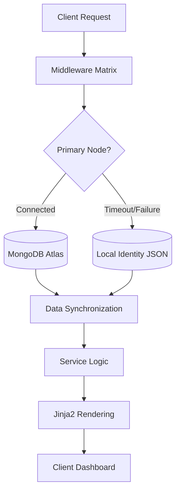

# 🌌 StockScope Elite: Obsidian Monolith
### Institutional-Grade Financial Intelligence & Neural Analytics

**StockScope Elite** is a high-performance, asynchronous financial dashboard built on the **Obsidian Monolith** architecture. It provides real-time telemetry from global markets, neural sentiment analysis of financial news, and a hardened identity system designed for 100% operational uptime.

---

## 🏛️ Project Philosophical Overview
The core mission of StockScope Elite is to provide a "Connectivity-Agnostic" environment for institutional-grade market analysis. By implementing the **Institutional Matrix** pattern, the application ensures that critical identity and analytical services remain active even during catastrophic cloud database or caching failures.

### Key Objectives:
- **Zero-Latency Telemetry**: Asynchronous data fetching from the Global Financial Mesh.
- **Fail-Safe Identity**: Dual-stage persistence to prevent lockout during DNS/SRV outages.
- **Traffic Sovereignity**: Granular control over request density and telemetry logging.

---

## 🏗️ Backend Architecture Design

The backend is structured as a **Synchronized Neural Hub**, where every component functions as a modular node within the Matrix.

### 1. The Central Neural Hub (FastAPI)
The core engine utilizing Python's `asyncio` to manage high-concurrency connections to external data nodes (Yahoo Finance, NewsAPI).

### 2. The Middleware Matrix (Security & Observability)
The application is wrapped in three critical layers of protection:
- **Logging Node**: Captures structured `NEURAL_PULSE` telemetry for every transaction.
- **Rate Limit Node**: Throttles aggressive request patterns (50 req/min) using the Neural Buffer.
- **Auth Sentinel**: Verifies JWT Identity Tokens and maps them to secure session cookies.

### 3. Data Flow & Persistence (The Identity Node)
The system employs a unique **Resilient Database Protocol**:


### 4. Neural Buffer (Caching Protocol)
To minimize latency and external API calls, a resilient caching layer is implemented:
- **Redis Node**: High-speed KV store for rate-limit tracking and frequent ticker summaries.
- **In-Memory Fallback**: An automatic dictionary-based buffer that engages if the Redis daemon is unreachable.

---

## 🛠️ Technology Stack Detail

| Component | Technology | Role |
| :--- | :--- | :--- |
| **Framework** | FastAPI | Async Core Engine |
| **Database** | MongoDB & Local JSON | Hybrid Identity Storage |
| **Caching** | Redis & In-Memory | Unified Neural Buffer |
| **Telemetry** | yfinance | Global Market Data |
| **Sentiment** | VaderSentiment | Neural News Analysis |
| **Auth** | JWT / Bcrypt | Secure Identity Mapping |

---

## 📡 Deployment & Activation

### System Requirements:
- Python 3.11+
- Redis Server (Optional, Fallback included)
- MongoDB Cluster (Optional, Fallback included)

### Activation Sequence:
```powershell
# 1. Initialize Virtual Environment
python -m venv venv
.\venv\Scripts\activate

# 2. Synchronize Dependencies
pip install -r requirements.txt

# 3. Bind the Hub to Port 8001
uvicorn main:app --port 8001 --reload
```

---
**Status: [SYSTEM_ARCHITECTURE_LOCKED] | VERSION: 2.1.0-MATRIX | OPERATOR: ADMIN**
